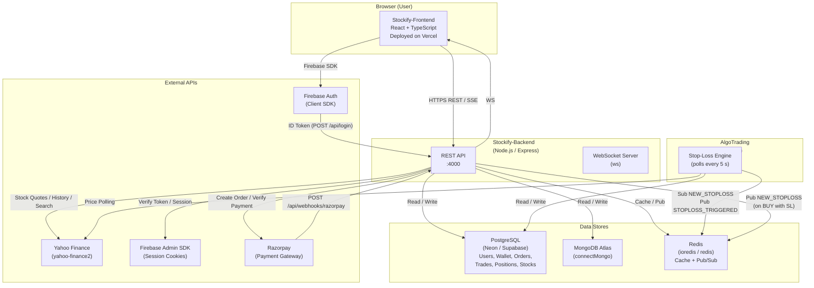
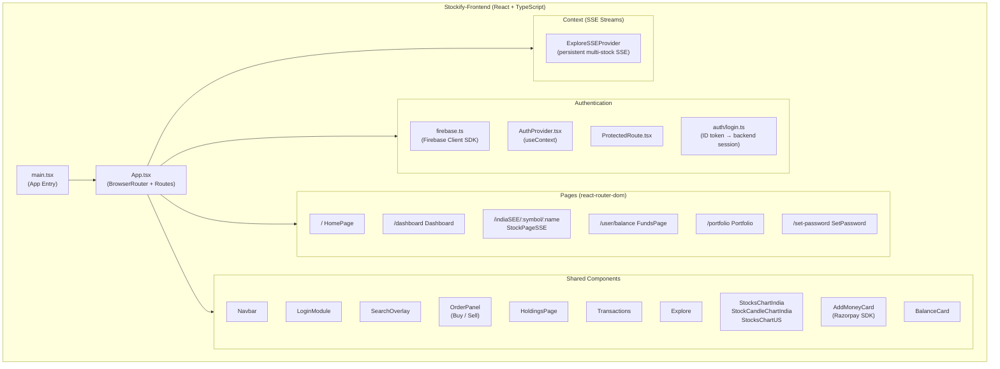
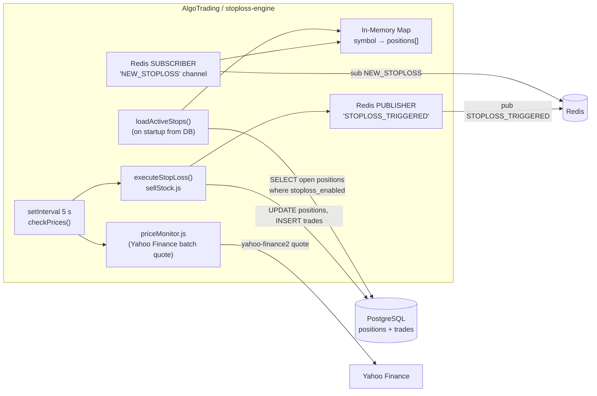
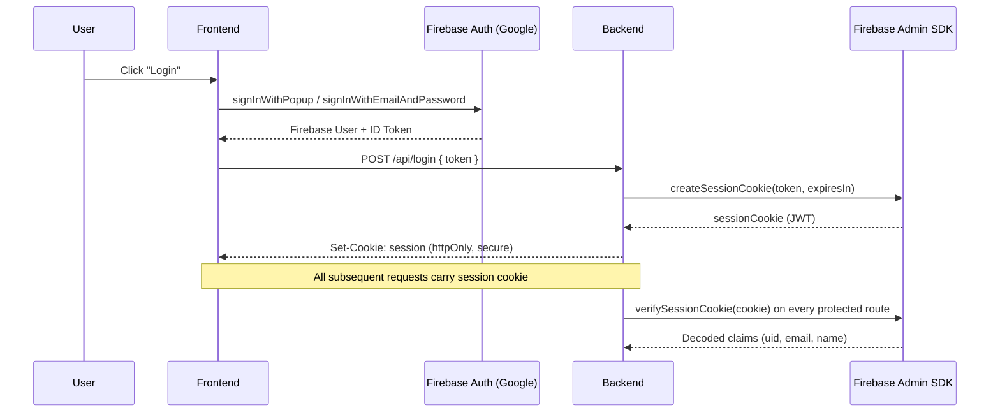
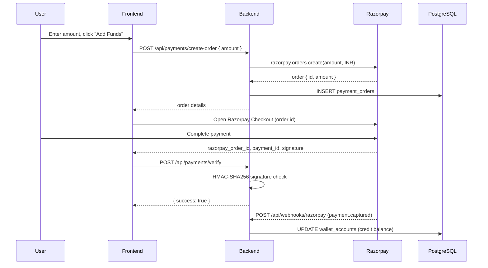
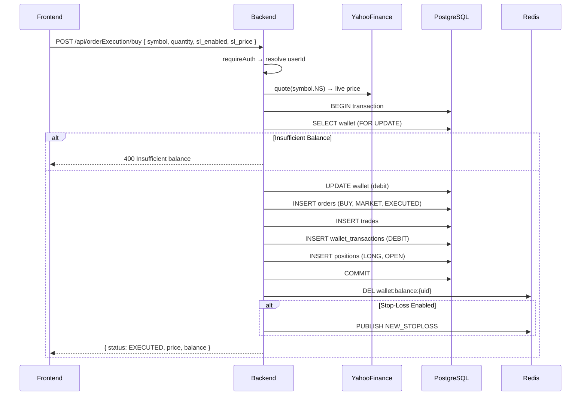

# Stockify – System Architecture

## Overview

Stockify is a full-stack paper-trading platform for Indian equities (NSE). It is composed of three distinct services:

| Service | Technology | Responsibility |
|---|---|---|
| **Stockify-Frontend** | React 19, TypeScript, Vite | Browser UI – charts, trading panel, portfolio |
| **Stockify-Backend** | Node.js, Express 5 | REST + SSE API, business logic, data persistence |
| **AlgoTrading** | Node.js, Express 5 | Automated stop-loss execution engine |

---

## High-Level Architecture



---

## Frontend Architecture



### Frontend Routes

| Path | Page | Auth Required |
|---|---|---|
| `/` | `HomePage` | No |
| `/indiaSEE/:symbol/:name` | `StockPageSSE` | No |
| `/user/balance` | `FundsPage` | ✅ Yes |
| `/portfolio` | `Portfolio` | ✅ Yes |
| `/set-password` | `SetPassword` | ✅ Yes |
| `/dashboard` | `Dashboard` | ✅ Yes |

---

## Backend Architecture

```mermaid
graph TB
    subgraph SB["Stockify-Backend (Express 5)"]
        Server["server.js\n(HTTP + WebSocket)"]

        subgraph MW["Middleware"]
            CORS["CORS\n(localhost, Vercel, ngrok)"]
            CP["cookie-parser"]
            Auth["requireAuth.js\n(Firebase session cookie)"]
            AdminJS["admin.js\n(Firebase Admin SDK)"]
        end

        subgraph Routes["API Routes"]
            Login["/api/login\n(POST login / logout / status)"]
            IndiaSEE["/api/indiaSEE/:symbol\n(SSE stream / history / quote)"]
            Search["/api/search\n/api/searchUpdates"]
            Explore["/api/explore\n(multi-stock SSE)"]
            Balance["/api/getBalance"]
            Payments["/api/payments\n(create-order / verify)"]
            Webhooks["/api/webhooks/razorpay"]
            Transactions["/api/transactions"]
            BuyStock["/api/orderExecution (buy)"]
            SellStock["/api/sellStock"]
            Holdings["/api/holdings"]
            Portfolio["/api/portfolio\n(summary / history)"]
        end

        subgraph DB["Database Layer"]
            Mongo["db/mongo.js\n(MongoDB Atlas)"]
            SQL["db/sql.js\n(PostgreSQL Pool)"]
        end

        subgraph Cache["Cache Layer"]
            RedisClient["cache/redisClient.js\n(ioredis)"]
            SearchCache["cache/searchCache.js"]
        end

        subgraph Services["External Service Wrappers"]
            YahooHistory["yahooIndiaHistory.service.js"]
            YahooQuote["yahooIndiaQuote.service.js"]
            YahooSearch["yahooSearch.js"]
            RazorpaySDK["razorpay.js\n(Razorpay SDK instance)"]
            Orders["payments/orders.js\n(createOrderRecord)"]
            DBUtils["modules/dbUtils.js\n(getUserId)"]
        end
    end

    Server --> MW
    Server --> Routes
    Routes --> DB
    Routes --> Cache
    Routes --> Services
```



### PostgreSQL Schema (Key Tables)

| Table | Purpose |
|---|---|
| `users` | Firebase UID → internal integer ID, name, email |
| `wallet_accounts` | Per-user cash balance (`available_balance`, `blocked_balance`) |
| `payment_orders` | Razorpay order records |
| `stocks` | Stock master: symbol, name, exchange, tick size |
| `orders` | Buy/sell orders (side, type, quantity, price, status) |
| `trades` | Executed trades with `realized_pnl` |
| `positions` | Open long positions with stop-loss metadata |
| `wallet_transactions` | Ledger of every debit/credit linked to trades or deposits |

### API Endpoint Reference

| Method | Endpoint | Auth | Description |
|---|---|---|---|
| `POST` | `/api/login` | No | Exchange Firebase ID token for session cookie |
| `POST` | `/api/login/logout` | No | Clear session cookie |
| `GET` | `/api/login/status` | No | Verify active session |
| `GET` | `/api/indiaSEE/:symbol/stream` | No | SSE live price stream |
| `GET` | `/api/indiaSEE/:symbol/history` | No | OHLCV history |
| `GET` | `/api/indiaSEE/:symbol/quote` | No | Latest quote |
| `GET` | `/api/search` | No | Yahoo Finance symbol search |
| `GET` | `/api/searchUpdates` | No | Cached bulk quote updates |
| `GET` | `/api/explore` | No | Multi-stock SSE stream |
| `GET` | `/api/getBalance/getBalance` | ✅ | Wallet balance (Redis-cached) |
| `POST` | `/api/payments/create-order` | ✅ | Create Razorpay order |
| `POST` | `/api/payments/verify` | ✅ | Verify Razorpay signature |
| `POST` | `/api/webhooks/razorpay` | No | Razorpay payment webhook |
| `GET` | `/api/transactions` | ✅ | Wallet transaction history |
| `POST` | `/api/orderExecution/buy` | ✅ | Market buy order |
| `POST` | `/api/sellStock` | ✅ | Market sell order |
| `GET` | `/api/holdings` | ✅ | Current open positions |
| `GET` | `/api/portfolio/summary` | ✅ | Portfolio P&L + holdings |
| `GET` | `/api/portfolio/history` | ✅ | Order/trade history |

---

## AlgoTrading – Stop-Loss Engine



**Flow:**
1. On startup the engine loads all open positions with stop-loss enabled from PostgreSQL into an in-memory `Map`.
2. The engine subscribes to the Redis `NEW_STOPLOSS` channel; when the backend processes a new buy order with a stop-loss price it publishes to this channel and the engine registers it instantly.
3. Every 5 seconds it fetches live prices from Yahoo Finance for all watched symbols.
4. If a price falls to or below a registered stop-loss level the position is closed via a direct PostgreSQL transaction (mirrors the sell endpoint logic) and a `STOPLOSS_TRIGGERED` event is published on Redis.

---

## Authentication Flow



---

## Payment Flow



---

## Order Execution Flow (Buy)



---

## Technology Stack Summary

### Frontend
| Category | Library / Tool |
|---|---|
| Framework | React 19 + TypeScript |
| Build Tool | Vite 7 |
| Routing | React Router DOM 7 |
| Charts | Chart.js 4, react-chartjs-2, chartjs-chart-financial |
| Auth | Firebase 12 (client SDK) |
| HTTP | Axios |
| Real-time | SSE (EventSource) |
| Payments | Razorpay Checkout JS |
| Deployment | Vercel |

### Backend
| Category | Library / Tool |
|---|---|
| Runtime | Node.js 18+ (ESM) |
| Framework | Express 5 |
| Auth | Firebase Admin SDK 13 |
| Databases | MongoDB (mongodb 7), PostgreSQL (pg 8) |
| Cache / PubSub | Redis (ioredis 5) |
| Stock Data | yahoo-finance2 3 |
| Payments | Razorpay SDK 2 |
| Real-time | SSE + WebSocket (ws 8) |

### AlgoTrading
| Category | Library / Tool |
|---|---|
| Runtime | Node.js 18+ (ESM) |
| Framework | Express 5 |
| Database | PostgreSQL (pg 8) |
| Cache / PubSub | Redis (ioredis 5, redis 5) |
| Stock Data | yahoo-finance2 3 |

---

## Deployment Topology

```
┌─────────────────────────────────────────────────────┐
│                    Internet                          │
└──────┬──────────────────────────┬───────────────────┘
       │                          │
┌──────▼──────┐           ┌───────▼────────┐
│   Vercel    │           │  Razorpay CDN  │
│  (Frontend) │           │  checkout.js   │
└──────┬──────┘           └───────┬────────┘
       │ HTTPS REST/SSE           │ webhooks
┌──────▼──────────────────────────▼────────┐
│         Stockify-Backend                 │
│         (Node.js / Express :4000)        │
└──────┬──────────┬──────────┬─────────────┘
       │          │          │
┌──────▼───┐ ┌───▼────┐ ┌───▼──────────────┐
│ MongoDB  │ │  PG    │ │     Redis         │
│  Atlas   │ │(Neon / │ │  (Redis Cloud)    │
│          │ │Supabase│ │  Cache + Pub/Sub  │
└──────────┘ └────────┘ └───────┬───────────┘
                                │ NEW_STOPLOSS
                        ┌───────▼────────────┐
                        │  AlgoTrading       │
                        │  Stop-Loss Engine  │
                        └────────────────────┘
```
